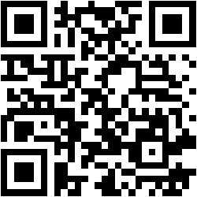

# Ribbon - Produktová stránka

Ribbon je moderná platobná platforma pre rýchle, bezpečné a jednoduché online platby. Či už predávate online, spravujete predplatné alebo prevádzkujete trhovisko, Ribbon poskytuje všetko potrebné pre efektívne spracovanie transakcií.

## Funkcie

- Responzívny dizajn (mobile-first)
- Moderné UI/UX
- Plynulé CSS & JS animácie
- Interaktívne prvky
- Architektúra založená na komponentoch
- Animovaný logotyp
- Zvýraznenie kariet
- Animácie pri skrolovaní (desktop/tablet)
- Kompatibilita medzi prehliadačmi

## Použitie

### Klonovanie repozitára

```bash
git clone https://github.com/Saydva/ProductPage.git
cd ProductPage
npm install
```

### Otvorenie projektu

```bash
npm run dev      # Spustenie vývojového servera
npm run build    # Zostavenie pre produkciu
npm run deploy   # Nasadenie na GitHub Pages
```

## Štruktúra projektu

Projekt používa Vite ako rýchly nástroj na zostavenie, SASS pre modulárne štýly a JavaScript pre interaktivitu. Štruktúra je organizovaná do priečinkov pre štýly, JavaScript a verejné súbory.

### Stromová štruktúra

```
ProductPage/
├── public/
│   └── qr-code.png
├── src/
│   ├── styles/
│   │   ├── base/
│   │   │   ├── variables.scss
│   │   │   ├── mixins.scss
│   │   │   ├── reset.scss
│   │   │   ├── typography.scss
│   │   │   └── opacity.scss
│   │   ├── layout/
│   │   │   ├── container.scss
│   │   │   ├── grid.scss
│   │   │   └── sections.scss
│   │   ├── components/
│   │   │   ├── hero.scss
│   │   │   ├── buttons.scss
│   │   │   ├── cards.scss
│   │   │   ├── steps.scss
│   │   │   ├── main-menu.scss
│   │   │   ├── firms-table.scss
│   │   │   └── contact.scss
│   │   ├── utils/
│   │   │   ├── responsive.scss
│   │   │   └── extra-scroll-padding.scss
│   │   └── main.scss
│   └── js/
│       ├── main-menu.js
│       ├── cards-highlight.js
│       ├── ribbon-logo-animate.js
│       ├── steps-animation.js
│       └── hero-animation.js
├── index.html
├── vite.config.js
├── package.json
├── package-lock.json
├── .gitignore
└── README.md
```

## Popis technológií a súborov

### HTML

- index.html: Hlavná stránka s HTML5 sémantickým označením.

### CSS

- SASS/SCSS súbory: Modulárne štýly pomocou @use importov pre kompatibilitu, premenné, mixiny a funkcie sú modulárne.

### JavaScript

- ES6+ JavaScript súbory: Moderný JS s jedným DOMContentLoaded eventom na súbor pre animácie a interaktivitu.

### Obrázky

- public/qr-code.png: QR kód pre rýchly prístup k stránke.

### Ostatné

- vite.config.js: Konfigurácia Vite s nastaveným base na /ProductPage/.
- package.json: Závislosti a skripty projektu.
- .gitignore: Súbory ignorované v Git.

## Ako projekt funguje

Projekt je produktová stránka pre Ribbon, ktorá demonštruje moderné webové vývojové praktiky. Používa responzívny dizajn, plynulé animácie a interaktívne prvky. Na malých obrazovkách sú kroky vždy viditeľné a menia sa na posúvateľný slider pre lepšiu použiteľnosť. Animácie sa nevykonávajú na mobile.

## Ako rozšíriť projekt

- Pridajte nové komponenty do src/styles/components/ a zodpovedajúce štýly.
- Pridajte novú funkcionalitu do src/js/ s novými JS súbormi.
- Aktualizujte index.html pre nové sekcie.
- Použite Vite pre rýchle zostavenie a nasadenie.

## Online verzia

Projekt live: [https://Saydva.github.io/ProductPage/](https://Saydva.github.io/ProductPage/)

### 📱 QR kód pre rýchly prístup


_Skenujte QR kód telefónom pre okamžitý prístup._

Thanks.!!
